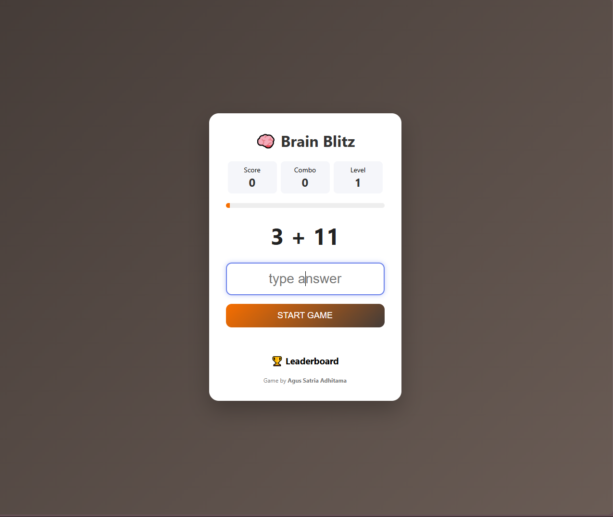

# 🧠 Brain Blitz

**Brain Blitz** is a fast-paced **math challenge web game** designed to test and improve your mental arithmetic skills.

Players must answer math questions quickly to increase their **score, combo streak, and level** before time runs out.

---

## 🎮 Live Demo

Play the game here:

👉 https://agusadhitama.github.io/game-berhitung/

---

## 🚀 Features

* 🧠 **Random Math Questions**
* ⚡ **Fast-paced gameplay**
* 📊 **Score System**
* 🔥 **Combo Streak Mechanic**
* 🎯 **Level Progression**
* ⏱ **Time-based challenge**
* 🏆 **Leaderboard section**

---

## 🎯 Gameplay

1. Click **Start Game**
2. Solve the math problem shown on the screen
3. Type the correct answer
4. Increase your **score and combo streak**
5. Reach higher **levels** by answering correctly

The faster and more accurate you are, the higher your score!

---

## 🧠 Tech Stack

This project was built using:

* **HTML5**
* **CSS3**
* **JavaScript**

Deployment:

* **GitHub Pages**

---

## 📸 Preview

<p align="center">

</p>

---

## 📂 Project Structure

```
brain-blitz/
│
├── index.html
├── style.css
├── script.js
├── assets/
├── images/
│   └── preview.png
└── README.md
```

---

## 🎮 Purpose of the Project

This project was created to demonstrate:

* JavaScript game logic
* DOM manipulation
* Interactive web application development
* UI design for browser-based games

---

## 👨‍💻 Author

**Agus Satria Adhitama**

IT Support • Web Developer • System & Network Enthusiast

GitHub
https://github.com/agusadhitama

---

⭐ If you like this project, consider giving it a **star**!
